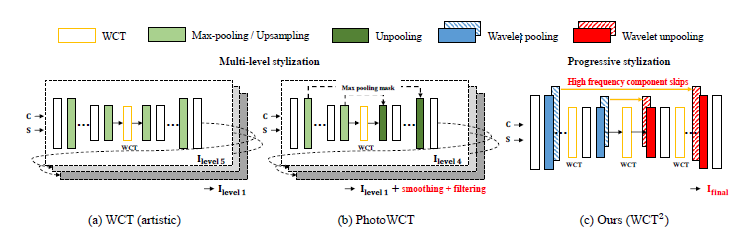
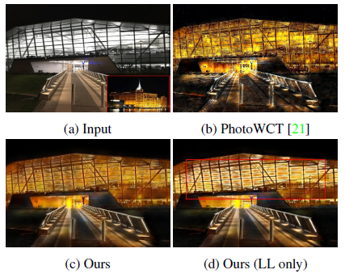
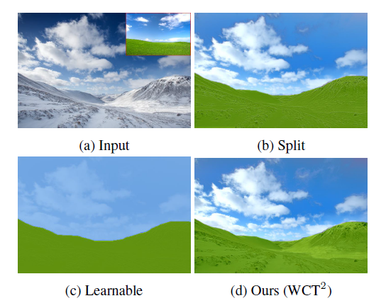
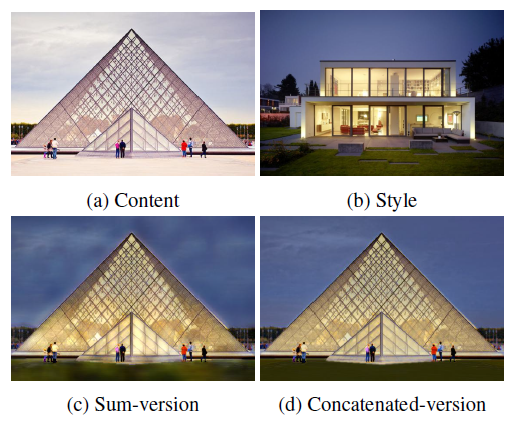
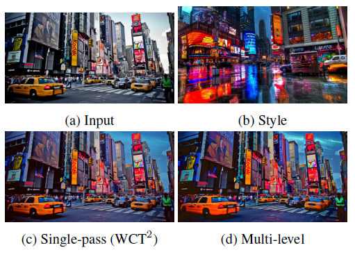
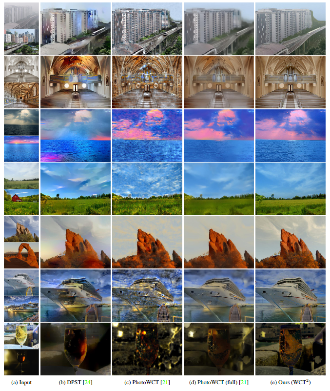

# Photorealistic-Style-Transfer

This repository contains a summary of the research paper [Photorealistic Style Transfer via Wavelet Transforms](https://arxiv.org/pdf/1903.09760v2.pdf) by Jaejun Yoo, Youngjung Uh, Sanghyuk Chun, Byeongkyu Kang and Jung-Woo Ha. Additionally it contains a PyTorch implementaion of the model. This was obtained from the official repository by the authors [here](https://github.com/clovaai/WCT2/tree/master). This repository serves as an exploration of the paper by me and is not an official implementation of the paper. All pretrained models and weights are obtained from the official repository.

## Introduction

This research paper focuses on style transfer between two images. Existing methods of style transfer are limited by spatial distortions or unrealistic artifacts. Here, a network architecture that enhances photorealism is introduced. Wavelet corrected transfer is proposed based on whitening and colouring transforms. Additionally, video stylization is also possible.

A photorealistic style transfer needs to:
- Apply the reference style
- Should not hurt the details of an image

The paper proposes a wavelet corrected transfer based on whitening and coloring transforms $(WCT^2)$ that substitutes the pooling and unpooling operations in the VGG encoder and decoder with wavelet pooling and unpooling

## Previous Works

### Whitening and Colouring Transform

Whitening and Colouring Transform comprises of 2 components. The whitening transform is used to remove corelation between features.

$$ X_{white} = E \Lambda^{-\frac{1}{2}} E^T X $$

where $X$ is the input feature map, $E$ is the eigenvector matrix and $\Lambda$ is the eigenvalue matrix. 

The colouring transform is used to re-introduce the correlation between features.

$$ X_{colored} = E_s \Lambda_s^{\frac{1}{2}} E_s^T E_c \Lambda_c^{-\frac{1}{2}} E_c^T X  $$

where $E_s$ and $E_c$ are the eigenvector matrices and $\Lambda_s$ and $\Lambda_c$ are the eigenvalue matrices of the style and content images respectively.

In style transfer, whitening is used to normalize the covariances and variances in the source image to be unit values and colouring is used to re-introduce the covariances and variances of the style to the whitened image this generating the stylized image. The issue is that the process has a time complexity of $O(n^3)$ where $n$ is the number of channels in the feature map. Additionally, computing the transform requires SVD for which backpropogation is non trivial. To overcome this issue, the research paper [Image-to-Image Translation via Group-wise Deep Whitening-and-Coloring
 Transformation](https://arxiv.org/pdf/1812.09912v2) proposes a deep neural network that approximates the whitening and colouring transforms.

### PhotoWCT

PhotoWCT replaced the upsampling laters of the VGG decoder with unpooling. The goal was to compensate for information loss during encoding. But it couldn't solve the information loss from the max pooling of the VGG network and required post processing steps.



## Wavelet Corrected Transfer

### Haar Wavelet Pooling

Haar wavelet pooling has four kernels. They are $\{LL^T, LH^T, HL^T, HH^T\}$ where the High (H) and Low(L) pass filters are:
$$
L^T = \frac{1}{\sqrt{2}} \begin{bmatrix}
1 & 1 \end{bmatrix}, H^T = \frac{1}{\sqrt{2}} \begin{bmatrix}
-1 & 1 \end{bmatrix}
$$

THerefore the output of the Haar wavelet pooling operation has four channels. Low pass filter captures smooth surface and texture while the high pass filters extract vertical, horizontal and diagonal edge information. Output of each kernel is given as LL, LH, HL and HH.

The signal can be reconstructed using the mirror operation (wavelet unpooling). Therefore there is minimal information loss unlike max pooling where there is no inverse operation. 

### Model Architecture

The model architecture is an improvement over PhotoWCT. The max pooling and unpooling layers are replaced wwith wavelet pooling and unpooling. ImageNet pre-trained VGG-19 is used as the encoder. High frequency components are directly passed to the decoder while only the low frequency component is passed to the next encoding layer.

## Stylization

### WCT

WCT performs style transfer with arbitrary styles by matching the correlation between content and the style in the VGG feature domain. The content features are projected to the eigenspace of style features using SVD. Then the transferred features are passed to the decoder to obtain the stylized image.

### Progressive Stylization

Previous approaches used a multi-level stylization. Here features are progressively transformed within a single forward pass. WCT is sequentially applied at each scale within a single encoder-decoder network. Training procedure is simple and it avoids the errors being amplified due to recursively encoding and decoding the signal in the VGG network.

## Analysis

### Wavelet Pooling

PhotoWCT suffers from loss of spatial information by max-pooling as shown below:



Since low frequency components capture textures and high frequency components detect edges, individually applying WCT to these components allows for individual stylization. If the style is only applied to the low frequency components as shown above, the edges remain unchanged. Only using the low frequency component is equivalent to average pooling.

### Ablation Study

The paper compares stylization results using other pooling variants. Split pooling and learnable pooling are studied. Split pooling can carry wole information. Learnable pooling is a trainable convolutional layer and it does not represent content faithfully.



### Unpooling Options

Concatenation was adopted instead of summing to acheive better reconstruction. Four feature components from the corresponding scale and feature output before wavelet pooling are concatenated. This produces better results at the cost of additional parameters. Summing produces a more stylized output while concatenation produces a clearer image.



### Progressive vs. multi-lelve strategy

Since wavelet pooling and unpooling are invertible operations, a multi-level strategy can be adopted to increase the contrast in the transfered style. This produces more vivid results.



## Results

Based on provided results, it is clear the the mew model produces higher quality photorealistic images compared to previous methods. Additionally it produces better results for video stylization. Memory utilization and runtime are also minimal compared to previous approaches.



## Instructions for Use

1. Clone the repository using the following command:
    ```git clone https://github.com/Warren-SJ/Photorealistic-Style-Transfer.git```

2. Navigate to the cloned directory:
    ```cd Photorealistic-Style-Transfer```

3. Run the following command to install the required packages:
    ```pip install -r requirements.txt```

4. Run the following command to start the application:
    ```python app.py```

5. Follow the instructions in the application to upload your content and style images. The application will then generate the stylized image in the output directory specified.